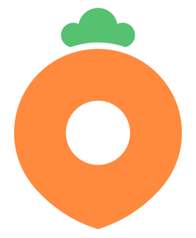
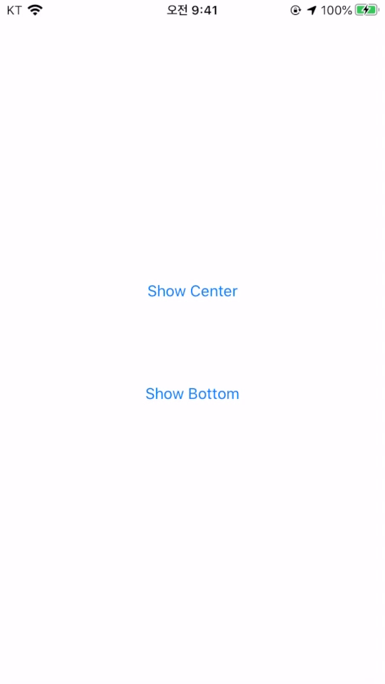

#  DaangnMarket Clone 
> 패스트캠퍼스 iOS School에서 진행했던 Backend School과의 협업 프로젝트입니다.

## Description

- Duration : 2020.03.20 ~ 2020.04.29
- Skills
  - Language : Swift
  - Framework : UIKit, CoreLocation
  - Service : FCM, APNs, Firebase Authorization(Phone)
  - Library : Then, Alamofire, SnapKit, KingFisher, SwiftLint
- Members : 4명 (LoC[1](#footnote1) 90%)
- Part
  - Firebase Authorization 서비스를 활용한 문자 인증 서비스 구현
  - FCM 및 APNs를 사용한 푸시 알림 구현
  - 위치기반 동네 설정 및 게시글이 노출될 주변 동네 설정 기능 구현
  - 채팅 UI 구현(기능은 Backend와 함께 계속 개발중)
  - 재사용되는 custom view를 추상화하여 팀원 모두가 사용할 수 있도록 제공(`DGUpperAlert`, `DGToastAlert`, `DGNavigationBar` 등)
  - 서버에 데이터를 요청하는 작업을 `API` class로 추상화 및 모듈화
  - iOS팀 팀장 역할을 맡아 프로젝트 기획, 일정 관리, Backend와의 커뮤니케이션, 원활한 협업을 위한 팀 내 Git 강의 및 Git 관련 trouble shooting 등을 주도
  - SwiftLint의 규칙들을 정독하고 팀원들과 상의하여 선별적으로 적용

## Design

- Flow chart : 초기 기획 단계에서 앱의 전체 흐름과 구현에서 제외할 부분을 파악함

  

    
  

- Wire frame : 앱 UI를 분석하고 flow chart를 구체화함

  

    
  

## Implementation

### Feature

- 동네 설정 및 문자 인증 기능 구현
  

    
    
  

  
- 푸시알림
  

    
    
  

  
- 채팅
  > 채팅은 UI 완성 후 backend와 작업중입니다.
  

    
  

### UI

- Custom alert : Toast 알림(`DGToastAlert`) 및 상단에서 내려오는 알림(`DGUpperAlert`)을 직접 구현
  

    
    
  

## 협업

- [Github](https://github.com/FinalProject-Team4https://github.com/FinalProject-Team4) : 해야 할 작업 단위로 issue를 등록하고 [project board](https://github.com/orgs/FinalProject-Team4/projects/4)에서 진행 상황을 파악하여 일정 관리

  

    
    
  

- Notion : 회의 및 trouble shooting 관리

  

    
  

- Slack : Web hook 기능을 통해 Github의 commit, issue, pull request 등을 실시간으로 알림받고 대응

  

    
  

## Trouble Shooting

- 효율적으로 협업할 수 있는 환경 구축
  - miro를 사용해 flowchart 제작 : 웹 기반으로 실행되어 접근성이 좋고 동시 작업이 가능함
  - Adobe XD를 사용해 wireframe 제작 : 사용하기 쉽고 다른 팀원의 수정 사항이 빠르게 반영되어 공유 작업하기 좋음
  - Github Organization에 backend와 iOS 팀의 프로젝트를 함께 관리하여 전체 진행 상황을 공유함
  - 효율적인 일정 관리 및 업무 분배를 위해 맡은 기능을 issue로 등록하고 markdown으로 task list를 작성하여 progress bar로 진행 상황을 공유하여 쉽게 파악할 수 있도록 함
  - Issue마다 팀 label 및 기능개발(feat), 버그수정(bug) 등 작업 종류 label을 붙여서 팀별로 어떤 작업을 하는지 파악함
- 다수의 팀원이 하나의 repository에서 개발할 때 발생할 수 있는 문제들을 최소화할 수 있는 방법이 필요함
  - 팀원들이 develop branch를 각자의 repository로 folk해서 개발하고 pull request를 요청하여 테스트가 완료된 코드를 upstream repository에 반영함
  - 여러 가지 feature들을 동시에 개발하고 테스트하기 위해 Git-Flow의 branch 전략을 적용하여 feature branch에서 개발 진행 후 완성된 기능을 develop으로 merge함
- `UITextView`에 입력된 텍스트가 줄바꿈이 될 때 `UITableViewCell`의 높이가 유동적으로 조절되지 못하는 문제
  - `UITextField`과 달리 `UITextView`는 여러 줄의 텍스트를 입력함에 따라 content size가 그에 맞게 늘어나지 않으므로, 직접 입력된 text에 맞는 `UITextView`의 크기를 조절해야함
  - Text가 입력될 때 `sizeThatFit(_:)`를 통해 입력된 텍스트에 딱 맞는 textView의 크기를 계산하여 constraint를 적용함
  - `UITableView`의 `beginUpdates()`와 `endUpdates()`를 사용하여 텍스트가 입력될 때 마다 `UITextView`의 높이 변화에 따라 Cell이 높이를 동적으로 update 하도록 함
- Chatting UI 구현 시 `UITableViewCell`이 message 크기에 맞게 줄어들지 않는 문제
  - `init(style:reuseIdentifier:)`에서 AutoLayout 적용 시 늘어났던 message view의 크기가 재사용되어 content 크기에 맞게 줄어들지 않음
  - `prepareForReuse()`에서 cell이 재사용 될 때 마다 message view의 크기를 최소로 조절하도록 함
- App이 terminate 상태일 때 푸시 알림을 터치하여 알림 페이지까지 들어가지 못하는 문제
  - App이 종료된 상태에서 push notification을 누르면 `application(_:didFinishLaunchingWithOptions)`에서 `launchOptions?[.remoteNotification]`으로 noti 정보를 가져옴
  - 하지만, `UserNotificationCenterDelegate`에서 `userNotificationcenter(_:didReceive:withCompleetionHandleer:)`를 구현하는 경우 `launchOptions`를 사용할 수 없고, push notification을 선택하는 동작은 모두 `didReceive` delegate method에서 이루어진다.
  - `NotificationTrigger` class를 사용하여 `didReceive` method가 호출되었을 때 앱의 상태(notRunning, foreground, background)에 따라 알림페이지로 이동시키는 trigger를 발생시켜서 해결

---

<b id="footnote1">1</b> Level of Contribution. 기여도 [↩︎](#sup1)

