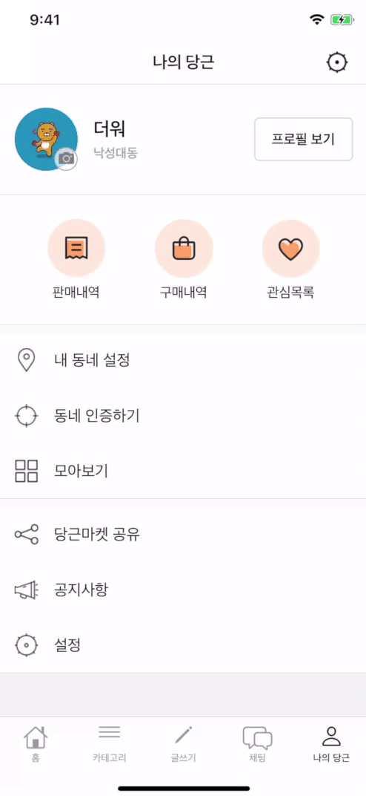

# DaangnMarket Clone

> 패스트캠퍼스에서 약 1달간(2020.03.20 ~ 2020.04.29) 진행한 Backend 수강생들과의 협업 프로젝트

## Description

- Storyboard 없이 code만 사용하여 Auto Layout으로 UI를 구현해 본 경험
- 필요에 따라 원하는 Custom View를 만들어서 사용해 본 경험
- 서버에 데이터를 요청할 때 query parameter의 encoding과 JSON format의 응답 데이터를 decoding하여 파싱하기 위한 Codable 객체를 design하고 사용한 경험
- 서버에 요청하는 데이터의 규모가 클 때, pagination을 통해 요청 횟수를 늘리는 대신 한 번에 요청하는 데이터의 양을 줄여서 속도를 향상시킨 경험
- Backend 개발자와 함께 데이터 구조를 고민하고 설계해 본 경험
- Push Notification을 위한 APNs 설정 및 FCM(Firebase Cloud Messaging)을 통한 서버 알림 구현 경험
- Firebase Authorization 기능을 활용한 문자 인증 서비스 구현 경험
- Cocoapods를 통한 다양한 open source library 사용 경험
  - 코드 가독성 향상을 위해 SwiftLint 적용 경험
  - Alamofire를 사용하여 REST API와 통신하고 `Result<Success, Failure>` 타입을 사용한 response 처리 경험
  - SnapKit을 사용하여 code base에서 Auto Layout을 사용한 UI 개발 경험

- Git과 Git-Flow를 사용한 프로젝트 관리 경험
  - CLI(iTerm2) 및 GUI(GitKraken) 환경에서 모두 git을 사용해 본 경험

## 사용 기술

- Language : Swift
- Framework : UIKit, CoreLocation
- Service : FCM, APNs, Firebase Authorization(Phone)
- Library : Then, Alamofire, SnapKit, KingFisher, SwiftLint

## 주요 기능

- 내 동네 설정 및 문자 인증, 로그인

  

    
    
  
  

- 게시글이 노출되는 동네 범위 설정

- 게시글 피드 및 카테고리별 목록 조회

  

    
    
  
  

- 중고거래 글쓰기

  

    
    
    
  
  

- 판매 상품 페이지 조회

    

 

- 마이당근 페이지 구현 (판매상품보기, 판매내역, 관심목록)

    
    
    

  

- FCM을 사용하여 Push Notification 구현

  

    
    
  
  

- 채팅(Backend와 함께 추가 구현 중)

  

    
  

  

## 사용 Tool

### 기획

- Wireframe 제작을 위해 Adobe XD 사용

  

    
  

- App 흐름을 파악하기 위해 Flow Chart 제작. [Miro](https://miro.com)를 사용하여 팀원들과 실시간으로 협업

  

    
  

  

### 개발

- GUI 툴(GitKraken)을 통해 git을 보다 직관적으로 사용하여 실수를 줄임

  

    
  

    
  

### 협업

- Github issue와 project board를 사용하여 팀원별로 맡은 작업과 진행상황을 효율적으로 파악

  

    
  
  

- Slack의 web hook 기능을 사용하여 Github issue, pull request 등을 알림으로 받아서 빠르게 대응

  

    
  

- Notion을 사용하여 커뮤니케이션 및 troubleshooting 진행

  

    
  

  

